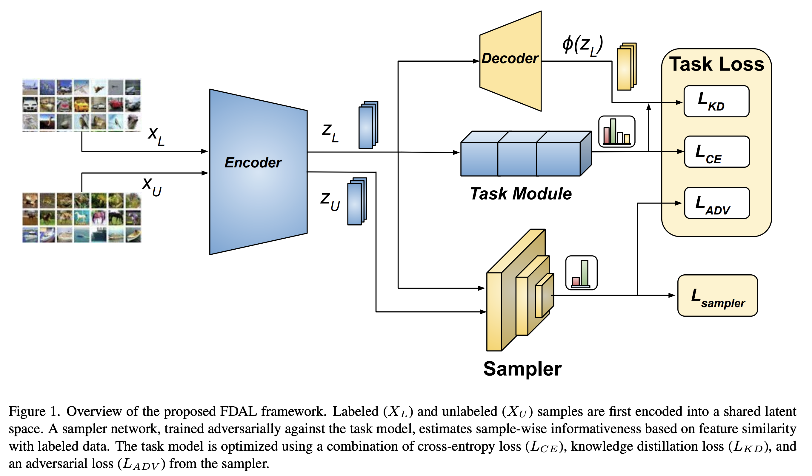

## FDAL: Leveraging Feature Distillation for Efficient and Task-Aware Active Learning

**Official PyTorch implementation of the paper**  
**"FDAL: Leveraging Feature Distillation for Efficient and Task-Aware Active Learning"**

**Authors**  
Rebati Gaire  
University of Illinois Chicago  
Chicago, Illinois  
rrgaire@uic.edu  

Arman Roohi  
University of Illinois Chicago  
Chicago, Illinois  
aroohi@uic.edu

### FDAL Framework



### Abstract

Active learning (AL) offers a promising strategy for reducing annotation costs by selectively querying informative samples. However, its deployment on edge devices remains fundamentally limited. In such resource-constrained environments, models must be highly compact to meet strict compute, memory, and energy budgets. These lightweight models, though efficient, suffer from limited representational capacity and are ill-equipped to support existing AL methods, which assume access to high-capacity networks capable of modeling uncertainty or learning expressive acquisition functions.

To address this, we introduce FDAL, a unified framework that couples task-aware AL with feature-distilled training to enable efficient and accurate learning on resource-limited devices. A task-aware sampler network, trained adversarially alongside a lightweight task model, exploits refined features from feature distillation to prioritize informative unlabeled instances for annotation. This joint optimization strategy ensures tight coupling between task utility and sampling efficacy. Extensive experiments on SVHN, CIFAR-10, and CIFAR-100 demonstrate that FDAL consistently outperforms state-of-the-art AL methods, achieving competitive accuracy with significantly fewer labels under limited compute and annotation budgets. Notably, FDAL achieves 78.5% accuracy on CIFAR-10 with only 30% labeled data, matching the fully supervised baseline of 78.38%.


### Prerequisites

- **Python**: 3.8+
- **GPU**: CUDA-capable GPU with recent NVIDIA drivers
- **PyTorch** and **Torchvision**
- Additional Python packages listed in `requirements.txt`

You should also download teacher checkpoints for CIFAR-10 and CIFAR-100 and place them under `checkpoints/`:

- `checkpoints/cifar10_vgg19_teacher.pth`
- `checkpoints/cifar100_vgg19_teacher.pth`

For the t-SNE visualization under `tsne/`, ResNet-based teachers are expected at:

- `checkpoints/cifar10_resnet50_teacher.pth`
- `checkpoints/cifar100_resnet50_teacher.pth`

You can update these paths in `config.py` and `tsne/config.py` if needed.

### Installation

Clone the repository and install dependencies:

```bash
git init
python -m venv .venv
source .venv/bin/activate  # On Windows: .venv\Scripts\activate
pip install --upgrade pip
pip install -r requirements.txt
```

Download CIFAR datasets (done automatically by the loaders on first run) and place teacher checkpoints into the `checkpoints/` folder as described above.

### Training

FDAL and the baselines are trained using `main.py`.

Example: FDAL on CIFAR-10

```bash
python main.py \
  --dataset cifar10 \
  --method_type FDAL \
  --no_of_epochs 200 \
  --cycles 10
```

Example: baseline methods

```bash
python main.py --dataset cifar10 --method_type CoreSet
python main.py --dataset cifar10 --method_type VAAL
python main.py --dataset cifar10 --method_type TA-VAAL
python main.py --dataset cifar10 --method_type UncertainGCN
python main.py --dataset cifar10 --method_type Lloss
```

The full list of supported methods is:

- `Random`, `CoreSet`, `Lloss`, `VAAL`, `TA-VAAL`, `UncertainGCN`, `CoreGCN`, `FDAL`

Training writes per-cycle results to text files of the form:

- `results_<METHOD>_<DATASET>_main10False.txt`

in the project root.

### Inference

After training, you can evaluate a saved task model or teacher on CIFAR-10 using the helper script `test.py` (or your own evaluation code built on top of `models/` and `load_dataset.py`).

A minimal example to evaluate the teacher on CIFAR-10 using the provided config:

```bash
python test.py
```

Make sure `TEACHER_PATH_C10` in `config.py` points to a valid checkpoint.

### Visualization

All visualization utilities live in the `visualization/` package; nothing related to visualization is kept at the top level.

- **Line graphs (label efficiency)**:

  ```bash
  python -m visualization.line_graph
  ```

  This reads the `results_*.txt` logs and generates a sampling comparison plot:

  - Output: `assets/FDAL_sampling_plot_<dataset>.png`

- **t-SNE plots (feature space)**:

  The t-SNE visualizations are generated during active learning using the `tsne` codepaths, which internally depend on `visualization/tsne_plots.py`:

  ```bash
  python tsne/main.py --dataset cifar10 --method_type FDAL
  ```

  This will:

  - Run active learning cycles for the specified method.
  - Extract backbone features.
  - Save t-SNE plots under:
    - `assets/tsne/tsne_cycle_<cycle>_<method>.pdf`

The visualization utilities themselves are implemented in:

- `visualization/line_graph.py`
- `visualization/tsne_plots.py`

### Results

Quantitative results for FDAL and baselines are stored as text logs:

- `results_<METHOD>_<DATASET>_main10False.txt`

You can convert these into publication-ready tables and figures. We recommend placing:

- **Quantitative tables** (e.g., `.tex` or `.csv`)
- **Line graph images**
- **t-SNE plots**

inside the `assets/` folder. The current visualization scripts already save their outputs there.

Example expected assets:

- `assets/FDAL_sampling_plot_cifar10.png`
- `assets/FDAL_sampling_plot_cifar100.png`
- `assets/tsne/tsne_cycle_*_FDAL.pdf`
- Any additional figures used in the paper.

You can also include final qualitative and quantitative result figures from the paper in `assets/`.  
For example, if you have a compiled results figure (e.g., combining line graphs, t-SNE, and tables), place it at `assets/fdal_results.png` and it will be rendered in the README:


### Citation

If you find FDAL useful in your research, please cite:

```bibtex
@inproceedings{gaire2025fdal,
  title={FDAL: Leveraging Feature Distillation for Efficient and Task-Aware Active Learning},
  author={Gaire, Rebati and Roohi, Arman},
  booktitle={Proceedings of the IEEE/CVF International Conference on Computer Vision},
  pages={3131--3138},
  year={2025}
}
```

### License

This repository is released under the MIT License. See `LICENSE` for details.

